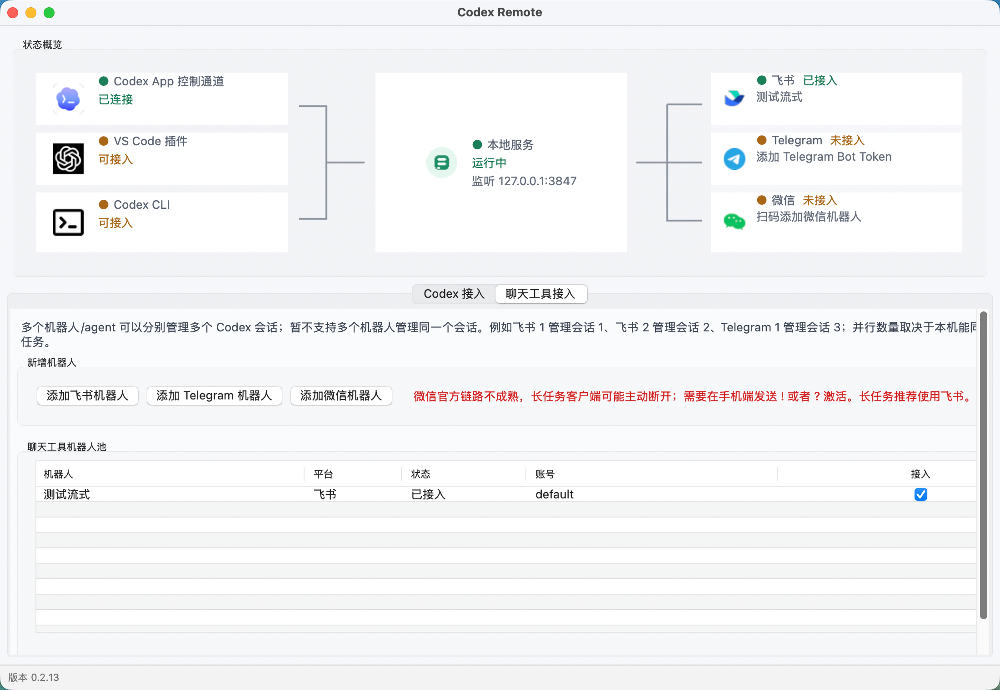
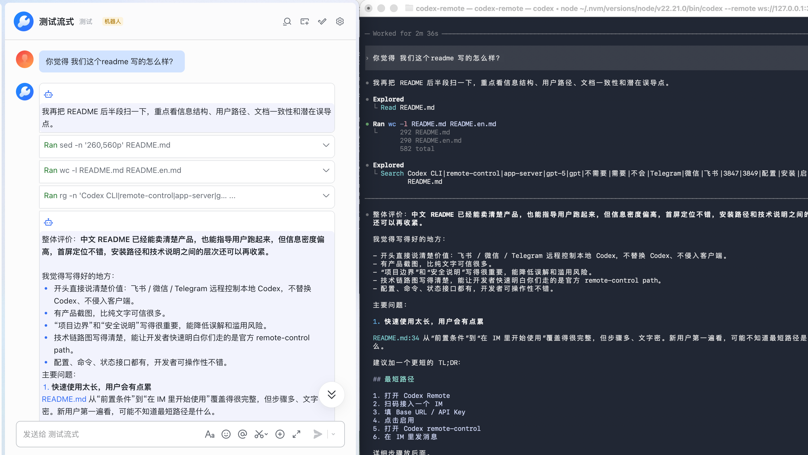

# codexhub

[中文说明](README.md)

## Product Preview

| Feature | Description |
| --- | --- |
| Remote and local side by side | Use Feishu, WeChat, and Telegram to control local Codex App, the Codex VS Code extension, and Codex CLI. The same Codex session can stay synchronized between IM and local clients. |
| Local Codex access | Does not modify Codex frontend code. Connect Codex App, the VS Code extension, and Codex CLI through the local backend. |
| Codex session management | Manage Codex session history from the GUI. After switching providers or enabling AI Gateway, move old sessions into the current entry so they still appear in the Codex App sidebar. |
| Manage Codex sessions from IM | Use the native Codex remote-control protocol to create and resume Codex sessions from IM. |
| Built-in AI Gateway | Keep Codex App on its native Responses entry while routing model calls to OpenAI, DeepSeek, Anthropic/Claude, Zhipu GLM, or compatible providers from the local GUI. |

<p align="center">
  
</p>
<p align="center">
  
</p>
<p align="center">
  
</p>

AI Gateway is a local model entry built into `codexhub`. Codex App keeps sending normal Responses-style requests, while `codexhub` routes them to the provider you configured and converts the result back into the shape Codex expects. Providers, visible models, model aliases, request logs, and image-generation-tool filtering are managed in the GUI.

<p align="center">
  
  
</p>
<p align="center">
  
</p>

## Quick Start

For Codex App and the VS Code extension, the usual flow is: download the app -> configure AI Gateway -> write Codex config -> restart Codex. Connect an IM channel only when you need Feishu, WeChat, or Telegram remote control. Codex CLI still requires starting its own app-server in step 7.

### 0. Prerequisites

- macOS, Windows, or Linux device
- Codex App, the Codex VS Code extension, or Codex CLI
- No ChatGPT account and no acceleration network required
- At least one model API key: OpenAI Responses, DeepSeek, Anthropic/Claude, Zhipu GLM, or another compatible provider
- Optional IM channel: needed only for Feishu, WeChat, or Telegram remote control

### 1. Install

Download `CodexHub.dmg` from GitHub Releases, drag it to Applications, then open it. On Windows, run `codexhub.exe` from the release package. On Linux, download `CodexHub Linux x86_64.AppImage`, make it executable, then double-click it.

If macOS warns that the app was downloaded from the internet, confirm the system prompt. If your Linux desktop does not mark the AppImage as executable automatically, run `chmod +x "CodexHub Linux x86_64.AppImage"` once. The app does not install startup items and does not run in the background automatically.

Later, use `Help -> Check for Updates` to manually check GitHub Releases for a newer version. The MVP only opens the download page; it does not silently replace the local app.

### 2. Open The App

Open `CodexHub`. The GUI starts the local backend automatically and stops the backend it started when the GUI exits.

Continue when the status overview shows the local service is running.

### 3. Connect An IM Channel (Optional, For Remote Control)

Open the `消息接入` page and choose one channel:

- Feishu: click `扫码使用新机器人` and complete QR onboarding.
- Telegram: paste the BotFather token and click `保存并接入`. Telegram currently supports private bot chats only; group chats are ignored.
- WeChat: click `扫码连接微信` and confirm in WeChat.
- WeCom: click `添加企业微信机器人` and confirm by scanning with WeCom. Direct/group text, streaming and final replies, image/file transfer, initial/history thread selection cards, and interactive approval template cards are supported.

After a channel is connected, the `IM 通道` status panel becomes available. Normal use does not require scanning or entering the token again unless you switch bots.

### 4. Configure AI Gateway

Open the `Codex 接入` page and add a model provider in the AI Gateway area. The GUI includes common provider templates, and you can also enter provider details manually:

- Provider name
- Provider type
- Third-party Base URL
- API Key
- Model list

If the upstream model name differs from the name you want to expose in Codex, use `Edit Model Aliases`. For example, the upstream model can be `GLM-5.2` while Codex shows `glm-5.2`.

If a provider rejects Codex's image generation tool, enable `Filter image generation tool`. It takes effect immediately and removes `image_generation` from outgoing AI Gateway requests.

### 5. Write Codex Config

Click `Write Codex Config` on the `Codex 接入` page. This points Codex App and the Codex VS Code extension at the local `codexhub` service and routes model requests through the local AI Gateway.

To go back to the previous Codex connection, click `Restore Codex Config`. The restore action is shown only after Codex config has been written.

### 6. Open Codex

Open Codex App or the Codex VS Code extension normally, then enable remote-control / control this computer.

When connected, `CodexHub` shows the Codex control channel as connected.

You do not need to see a remote device list in Codex App's connection settings. This project uses a local backend plus IM bridge. If the `CodexHub` status overview is normal, you can use it directly from the connected IM channel.

If Codex App, the Codex VS Code extension, and Codex CLI are connected to `CodexHub` at the same time, new or resumed IM sessions choose the execution endpoint by fixed priority: Codex App > Codex VS Code extension > Codex CLI. After a session is bound, later messages keep using the selected endpoint until the IM session exits or binds again.

### 7. Use Codex CLI

If you want Codex CLI to work with Feishu / Telegram / WeChat, you do not need to replace the `codex` command or install a wrapper. Use the same three-step flow on macOS, Windows, and Linux.

1. Open the `CodexHub` desktop app, finish IM channel setup and Codex access, and keep it running.

2. Open a terminal in the project directory and start Codex app-server:

```text
codex app-server --listen ws://127.0.0.1:3849 --remote-control
```

3. Open another terminal in the same project directory and connect the local Codex TUI:

```text
codex --remote ws://127.0.0.1:3849
```

After that, you can message the bot from IM, and you can also keep using the same Codex app-server from local Codex TUI. If port `3849` is already in use, choose another local port, but keep the addresses in step 2 and step 3 identical.

### 8. Use IM

Send a message to the bot in Feishu, a Telegram private chat, WeChat, or WeCom.

If the IM chat is not bound to a Codex thread yet, the bot first asks you to create a new thread or resume an existing one. After selection, the chat is bridged to that Codex thread.

The WeChat path depends on a context token issued by the WeChat client. During long tasks or when the phone client has been inactive for a while, the token may expire and the local backend may temporarily be unable to send messages. If this happens, send `!` or `?` in WeChat to refresh the token. These activation messages are only used to recover the send path and are not forwarded to Codex.

## Network and Proxy

The Network menu provides three outbound modes: use the system proxy, connect directly, or use a custom HTTP/SOCKS5 proxy. This setting only affects requests CodexHub sends to model providers, WeChat, Telegram, Feishu HTTP APIs, and update endpoints. It does not modify macOS `launchctl`, Windows user environment variables, or networking for other applications.

For a local Clash or V2Ray proxy, select the custom proxy option and enter `http://127.0.0.1:7890` or `socks5://127.0.0.1:1080`. The setting applies immediately while the daemon is running. Loopback communication between the GUI, Codex App, VS Code, and CodexHub does not use this outbound proxy.

TUN and Network Extension VPNs operate below the HTTP proxy layer. If such a VPN intercepts loopback traffic, exclude `localhost`, `127.0.0.1`, and `::1` in the VPN application.

## AI Gateway

AI Gateway solves one practical problem: Codex expects its native model entry, but users often want to use more model providers. After providers are configured in the GUI, Codex App still sees a normal model list; `codexhub` handles provider routing and protocol conversion locally.

Current highlights:

- OpenAI Responses providers for native or compatible Responses services.
- DeepSeek / Chat Completions providers with conversion back to Codex-compatible Responses output.
- Anthropic Messages providers for Claude / Anthropic-compatible models, including text, images, tool calls, thinking output, and web search conversion.
- Zhipu GLM through the Anthropic-compatible path, including GLM web search normalization.
- Model aliases for case differences, provider-specific names, and third-party relay names.
- Codex visible model selection.
- Request logs with original Codex request, upstream request, response or error, tokens, cache usage, cost, latency, TTFT, and request body size.
- Image generation tool filtering, disabled by default.

All of this is configured from the GUI. Users do not need to hand-edit config files.

## Community And Support

For questions or feedback, open a GitHub issue or message me through the WeChat public account.


The WeChat group is for issue feedback, usage discussion, and feature suggestions.


## IM Commands

Only `/q` is needed in normal use. Follow the card prompts for other actions.

```text
/q         interrupt and clear the current binding
```

Approval prompts are updated after selection where the platform supports it.

## Restore Codex Config

Click `Restore Codex Config` in the GUI to restore the Codex connection from before setup. After restore, Codex App no longer sends model requests through the local AI Gateway.

This does not uninstall Codex and does not delete Codex session history.

## Project Boundary

`codexhub` only supports the clean official Codex remote-control path.

It does not:

- install a `codex` wrapper
- replace Codex CLI
- launch Codex App through a shim
- install login items or startup agents
- run as a background service automatically
- change Codex model, sandbox, approval policy, cwd, or environment

The local backend starts only when the user opens the GUI or explicitly starts it from development tooling.

## Technical Notes

Runtime path:

```text
Codex App / Codex VS Code extension / Codex CLI app-server
  |
  | chatgpt_base_url = "http://127.0.0.1:3847/backend-api"
  | user enables remote control, or starts codex app-server --remote-control
  v
official Codex app-server
  |
  | outbound remote-control websocket
  v
codexhub local backend
  |
  | Feishu websocket events
  | Feishu message/card APIs
  | Telegram long polling
  | Telegram Bot API
  | WeChat iLink long polling
  | WeChat sendmessage API
  | WeCom AI Bot WebSocket / aibot_send_msg
  v
IM channel
```

The project implements the official remote-control endpoints:

```text
POST /backend-api/wham/remote/control/server/enroll
GET  /backend-api/wham/remote/control/server
```

Codex remote-control requires a ChatGPT-compatible auth mode. This project writes local `ChatgptAuthTokens` to satisfy Codex App's remote-control account check. API-key-only auth does not start remote control.

Thread binding model:

- Codex app-server remains the source of truth for thread lifecycle and history.
- One IM chat binds to one Codex thread at a time.
- If the IM chat has not bound a thread yet, the bridge asks whether to create or resume a thread.
- Resuming a thread from IM subscribes to that thread's future remote-control events.
- IM-origin turns are tracked by turn id to avoid `userMessage` echo.

## Development

```powershell
cargo fmt
cargo test
cargo build --release --features gui --bin codexhub
```

The Electron GUI lives in `electron-ui/`; the Rust core still runs through the `daemon` command. For local UI development:

```powershell
cd electron-ui
npm install
npm run dev
```

You can also launch the Electron GUI through the Rust entrypoint:

```powershell
cargo run --features gui -- gui
```

Useful status endpoints while the daemon is running:

```text
GET http://127.0.0.1:3847/api/status
GET http://127.0.0.1:3847/api/remote-control/status
GET http://127.0.0.1:3847/api/remote-control/backend-status
GET http://127.0.0.1:3847/api/events
```

## Security Notes

- The daemon binds to `127.0.0.1` by default. Do not expose it publicly.
- Locally saved IM tokens, model API keys, and Codex auth data are secrets; do not commit them.
- Attachments from Feishu are downloaded to a local state-adjacent `.im/attachments/feishu/` directory.
- Restrict access with `allowedOpenIds` and/or `allowedChatIds` for real usage.
- The bridge can send approval decisions to Codex. Treat Feishu / Telegram / WeChat / WeCom access as equivalent to local Codex approval access.

## More Docs

- [Architecture](docs/architecture.md)
- [WeChat integration plan](docs/wechat-integration-plan.zh-CN.md)
- [Auth notes](docs/auth-notes.md)
- [Troubleshooting](docs/troubleshooting.md)

## License

Apache-2.0
