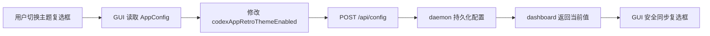
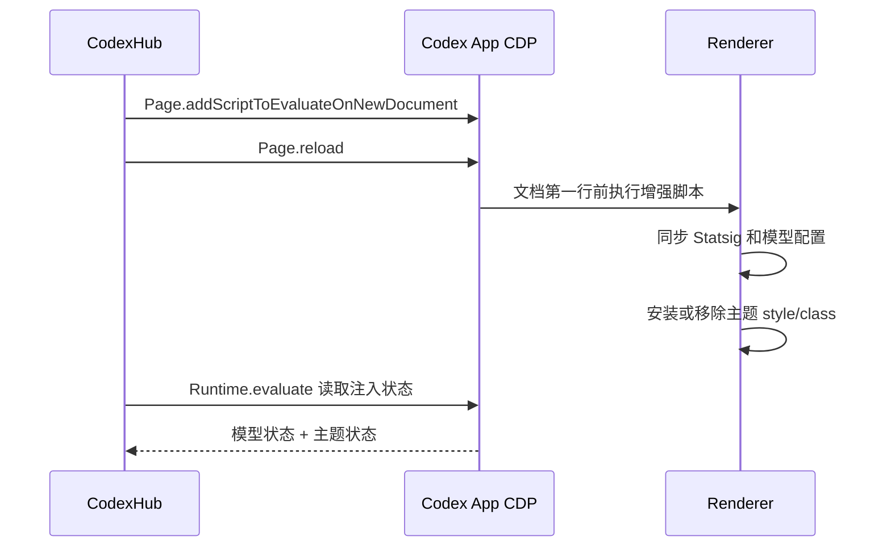

# CodexHub 2007 复古主题制作与维护

> 状态：第一版已接入。主题默认关闭，只在用户主动使用“增强模式启动 Codex App”时应用。

## 1. 文档目的

本文记录 CodexHub 2007 复古主题从视觉稿到产品代码的完整方法，方便后续：

1. 调整颜色、字体、边框和阴影；
2. 增加新的安全视觉样式；
3. 在 Codex App 更新后快速验证兼容性；
4. 排查“开关已启用但主题未生效”或“局部样式失效”等问题；
5. 避免重新走修改 `app.asar`、LevelDB 或 React 结构的高风险路线。

相关背景文档：

- `docs/codex-app-cdp-model-diagnostics.zh-CN.md`
- `docs/codex-app-web-run-model-visibility-tradeoff.zh-CN.md`
- `docs/codex-app-fast-startup-statsig.zh-CN.md`

## 2. 目标与边界

### 2.1 目标

主题要保留 Codex App 现有的任务、会话、工作区、工具调用和窗口行为，只改变视觉表现：

- 早期 Windows / 经典桌面软件的蓝色层次；
- Tahoma、微软雅黑和 Segoe UI 组成的清晰字体栈；
- 较硬朗的边框、轻微内阴影和低圆角；
- 白色内容区、浅蓝工具区和深蓝标题区；
- 输入框、按钮、代码块和滚动条保持统一视觉语言。

### 2.2 非目标

第一版明确不做：

- 不移动左侧任务区、中央会话区或右侧工作区；
- 不把 Codex App 改造成传统 IDE 布局；
- 不隐藏、复制或重建任何 React 组件；
- 不修改 `app.asar`；
- 不写 Codex App 的 LevelDB；
- 不创建或修改系统快捷方式；
- 不注入像素机器人等可能遮挡真实内容的伪元素；
- 不影响普通启动、VS Code 插件或 Codex CLI。

## 3. 为什么选择“增强启动 + 受限 CSS”

Codex App 没有公开的自定义主题接口。可选路线主要有三条：

| 路线 | 优点 | 主要问题 | 结论 |
|---|---|---|---|
| 修改 `app.asar` | 可直接改 renderer 代码 | Windows MSIX、macOS 签名、多架构和频繁更新都需要持续维护 | 不采用 |
| 修改 LevelDB / 前端缓存 | 不需要每次注入 | 数据结构私有，生命周期不稳定，可能污染用户状态 | 不采用 |
| 增强启动时通过 CDP 注入受限 CSS | 不修改安装包，退出 App 后自然消失 | 需要用户从 CodexHub 主动增强启动 | 当前方案 |

增强模式本来已经通过 CDP 在 renderer 第一帧同步模型白名单和必要 Statsig 配置。主题复用同一个 CDP 会话和同一段 preload 脚本，不启动第二个注入器，也不增加后台轮询。

## 4. 从视觉稿到生产主题

### 4.1 先做独立视觉稿

视觉稿位于：

```text
docs/mockups/codexhub-2007-theme.html
```

它用于验证颜色、层次、字体、边框和整体气质，可以直接在浏览器打开。视觉稿中的窗口框、三栏布局、文件树、会话内容和像素机器人都是演示内容，不是 Codex App 的 DOM 契约。

视觉稿允许完整模拟界面，生产主题只抽取以下视觉变量：

| 类别 | 视觉稿取值示例 | 生产用途 |
|---|---|---|
| 深蓝 | `#0a4f9e`、`#06366f` | 标题区域、文字阴影 |
| 中蓝 | `#1265bc`、`#2b7ed1` | 强调与选区 |
| 浅蓝 | `#dceefa`、`#c5e0f4` | 按钮、侧栏、工具表面 |
| 边框 | `#78a9d4`、`#b5d3ec` | 面板、输入框、滚动条 |
| 正文 | `#172c45` | 主文本 |
| 纸面 | `#ffffff`、`#f6fbff` | 会话和输入区域 |

### 4.2 不复制视觉稿的结构 CSS

视觉稿包含 `display`、`position`、`grid`、尺寸和间距等完整页面布局。将这些规则直接注入 Codex App 会造成：

- React 组件错位或不可点击；
- 窗口缩放时重叠、截断或重影；
- Codex App 更新 class 或层级后大面积失效；
- 工具弹窗、命令面板和无障碍结构被破坏。

因此生产 CSS 只能表达外观，不负责布局。

## 5. 生产 CSS 的安全规则

生产主题定义在：

```text
src/codex_app_enhanced.rs::retro_theme_css()
```

### 5.1 允许的属性

- `color`
- `background` / `background-image`
- `font-family`
- `letter-spacing`
- `border` / `border-color` / `border-radius`
- `box-shadow`
- `text-shadow`
- `color-scheme`
- `scrollbar-color`

### 5.2 禁止的属性

以下属性可能改变组件几何结构、点击区域或排序，生产主题禁止使用：

- `display`
- `position`
- `order`
- `width` / `min-width` / `max-width`
- `height` / `min-height` / `max-height`
- `flex` 及其派生属性
- `grid` 及其派生属性
- `overflow`
- `pointer-events`
- `transform`
- `margin` / `padding`
- `top` / `right` / `bottom` / `left`

单元测试 `retro_theme_css_only_changes_visual_properties` 会扫描这些属性。新增 CSS 时如果误用结构属性，测试会直接失败。

### 5.3 选择器原则

优先使用语义相对稳定、影响范围明确的选择器：

```css
html.codexhub-retro-theme body
aside.app-shell-left-panel
main.main-surface
header.app-header-tint
.composer-surface-chrome
.app-shell-main-content-viewport
[role="tabpanel"]
button
input
textarea
pre
code
```

选择器必须统一挂在：

```css
html.codexhub-retro-theme
```

这样关闭主题时只需移除根 class，所有规则就会立即失去作用。

不要依赖：

- 压缩 bundle 生成的短 class 名；
- `nth-child` 或固定 DOM 层级；
- React 内部属性；
- 特定文本内容；
- 某个版本才存在的随机 data 属性。

### 5.4 迭代结论：保持第一版窄作用域

真实界面截图验证后，第二版和第三版均已撤回。两版为了增强视觉效果，逐步扩大到通用 `role`、状态属性和 `[class*=...]` 通配选择器，结果把任务列表、弹窗、菜单和正文容器误识别成按钮或主面板，破坏了原有视觉层次。

当前生产主题恢复第一版规则：

1. 侧栏、主内容区、标题栏和输入容器只使用已确认的精确语义 class；
2. 通用规则仅保留原生 `button`、`input`、`textarea`、`pre` 和 `code` 元素；
3. 禁止 `html.codexhub-retro-theme *` 全局覆盖；
4. 禁止 `[class*=...]`、通用 `[role="button"]`、通用状态属性等扩大作用域的选择器；
5. 单元测试 `retro_theme_css_keeps_selectors_narrow` 固化这条边界，避免后续再次误伤界面。

后续视觉调整应在第一版基础上逐个确认真实 DOM 目标，每次只增加一个有明确归属的精确选择器，并用增强启动后的真实界面截图验收。


## 6. 配置和 GUI 链路

### 6.1 持久化配置

`src/config.rs::AppConfig` 中增加：

```rust
pub codex_app_retro_theme_enabled: bool
```

TOML 序列化字段为：

```toml
codexAppRetroThemeEnabled = true
```

默认值为 `false`。旧版本配置缺少该字段时会自动使用默认值，不需要迁移脚本。

### 6.2 GUI 开关

开关位于 Codex 接入页的本地配置区域：

```text
CodexHub 2007 复古主题
```

主要代码：

- `src/gui/codex_tab.rs::create`
- `src/gui/codex_tab.rs::bind_retro_theme_action`
- `src/gui/codex_tab.rs::refresh_retro_theme`
- `src/gui/codex_tab.rs::save_retro_theme`
- `src/gui/text.rs::codex_retro_theme`
- `src/gui/text.rs::codex_retro_theme_help`

数据流如下：



`retro_theme_syncing` 用来区分“用户点击”和“dashboard 回填”。没有这个保护时，程序调用 `set_value()` 可能再次触发保存，形成重复请求。

## 7. 增强启动如何注入主题

### 7.1 启动参数来源

`src/web/codex_app.rs::launch_codex_app_enhanced` 在启动前读取：

1. CodexHub 可见模型列表；
2. 本地 backend URL；
3. `codex_app_retro_theme_enabled`。

然后调用：

```rust
codex_app_enhanced::launch_and_inject(models, &backend_url, retro_theme_enabled)
```

### 7.2 同一段首帧脚本

`src/codex_app_enhanced.rs::enhanced_statsig_script` 同时包含：

- Statsig 模型列表与关键 gate 同步；
- 启动期 bootstrap 兼容；
- CodexHub 2007 主题安装与移除。

CDP 执行顺序：



### 7.3 Style ID 与根 class

主题使用两个固定标识：

```rust
const RETRO_THEME_STYLE_ID: &str = "codexhub-2007-retro-theme";
const RETRO_THEME_ROOT_CLASS: &str = "codexhub-retro-theme";
```

启用时：

1. 查找固定 ID 的 `<style>`；
2. 不存在则创建，存在则更新内容；
3. 给 `document.documentElement` 增加根 class；
4. 记录 `retroThemeEnabled=true` 和实际应用状态。

关闭时：

1. 删除固定 ID 的 `<style>`；
2. 移除根 class；
3. 记录 `retroThemeEnabled=false`、`retroThemeApplied=false`。

该过程是幂等的：同一个增强会话重复执行不会创建多个 `<style>`。

### 7.4 DOM 尚未创建时

`Page.addScriptToEvaluateOnNewDocument` 可能早于 `<html>` 节点创建。此时脚本只注册一次 `DOMContentLoaded`，等根节点出现后再应用当前期望值。

回调不会捕获旧开关值，而是重新读取：

```js
window.__CODEXHUB_ENHANCED_MODE__?.retroThemeEnabled
```

因此在 DOM 就绪前发生配置更新时，不会错误应用旧主题。

### 7.5 为什么不用 MutationObserver 或 timer

主题样式挂在根 class 上，由 CSS 自然覆盖后续 React 节点，不需要监视 DOM。禁止使用：

- `MutationObserver`
- `setInterval`
- 周期性 query selector
- 定时重复写 style

现有增强脚本中的短生命周期 `setTimeout` 只用于等待 Statsig client 初始化，与主题无关；主题本身完全事件驱动。

## 8. 启动完成判定

`EnhancedLaunchReport` 增加：

```text
retroThemeEnabled
retroThemeApplied
```

增强启动只有同时满足以下条件才报告配置就绪：

1. Statsig client 已可读取模型 dynamic config；
2. `available_models` 与 CodexHub 期望列表一致；
3. `use_hidden_models=false`；
4. 必要 feature gates 已生效；
5. renderer 中记录的主题开关与配置一致；
6. 主题启用时，固定 style 和根 class 都真实存在；
7. 主题关闭时，状态检查确认主题未处于应用状态；移除函数会同时删除固定 style 和根 class。

日志中可以看到：

```text
event=config_ready ... retro_theme_enabled=true retro_theme_applied=true
```

这可以区分“用户确实启用了主题”和“CSS 已经进入当前 renderer”。

## 9. 生命周期与恢复行为

| 操作 | 结果 |
|---|---|
| 普通方式启动 Codex App | 不注入主题，保持官方界面 |
| 勾选主题但不增强启动 | 只保存偏好，不改变当前 Codex App |
| 勾选后增强启动 | 同步模型并应用复古主题 |
| 取消勾选后增强启动 | 删除主题 style/class，恢复官方主题 |
| 完全退出 Codex App | 本次 renderer 内存状态和 CDP 端口一起消失 |
| 卸载 CodexHub | Codex App 安装目录没有被修改，无 ASAR 补丁需要恢复 |

如果用户已经在增强主题模式中运行 Codex App，取消复选框不会跨进程即时修改当前窗口。用户完全退出 Codex App，再次增强启动后恢复官方主题。这一设计避免 GUI 在用户工作过程中远程改写界面。

## 10. Windows 与 macOS

主题脚本作用于 Electron renderer，本身不区分 Windows 和 macOS。平台差异只存在于 Codex App 的启动方式：

- Windows 使用 MSIX App 激活并传入本机调试参数；
- macOS 启动应用包并传入相同的 CDP 参数；
- 两个平台都只绑定 loopback CDP 地址；
- 两个平台共用同一套 CSS、状态检查和测试。

新增 CSS 时仍要分别人工检查字体回退、原生滚动条和系统缩放效果。

## 11. 测试方法

### 11.1 自动测试

```powershell
cargo fmt
cargo test
```

主题相关测试覆盖：

- 配置默认关闭；
- TOML 序列化和反序列化；
- 启用脚本包含 style ID 和根 class；
- 关闭脚本能够移除 style 和 class；
- 脚本不包含 `MutationObserver`、`setInterval` 或 `Page.navigate`；
- CSS 不包含结构属性；
- 启动就绪检查同时验证模型和主题状态。

### 11.2 GUI release 构建

如果标准 release 文件正被运行中的 CodexHub 占用，可以使用独立输出名：

```powershell
cargo rustc --release --features gui --bin codexhub -- -o D:\rust_demo\codexhub\target\release\codexhub-retro-verify.exe
```

### 11.3 人工验收

1. 启动带 GUI 的 CodexHub；
2. 进入“Codex 接入”；
3. 勾选“CodexHub 2007 复古主题”；
4. 确保 Codex App 已完全退出；
5. 点击“增强模式启动 Codex App”；
6. 检查任务列表、会话、工作区、输入框、按钮、代码块和弹窗；
7. 改变窗口大小，确认没有遮挡、错位、重影或不可点击区域；
8. 新建任务并执行一次工具调用，确认交互行为未改变；
9. 取消勾选，完全退出后再次增强启动；
10. 确认官方主题恢复。

不要在自动测试中操作用户正在运行的真实 Codex App，也不要用固定测试端口导航未知 renderer。

## 12. Codex App 更新后的维护清单

每次 Codex App 更新后按以下顺序验证：

1. 增强模式是否仍能打开 loopback CDP target；
2. `Page.addScriptToEvaluateOnNewDocument` 是否仍在 renderer 第一帧执行；
3. `html.codexhub-retro-theme` 和固定 style 是否存在；
4. `aside.app-shell-left-panel`、`main.main-surface`、`header.app-header-tint` 等语义 class 是否仍存在；
5. composer、按钮、输入框、代码块和滚动条是否仍有合理对比度；
6. 模型列表和 Statsig gate 是否仍正常；
7. 普通启动是否完全不受影响；
8. Windows 与 macOS 是否都能恢复官方主题；
9. `cargo test` 和 GUI release 构建是否通过。

如果某个语义 class 消失，只调整对应外观选择器。不要为了追上新版 DOM 而加入固定层级、尺寸或 `MutationObserver`。

## 13. 如何安全扩展主题

新增视觉效果时遵循以下流程：

1. 先在 `docs/mockups/codexhub-2007-theme.html` 调整并浏览器验收；
2. 判断改动是“外观”还是“结构”；
3. 结构改动停留在视觉稿，不进入生产主题；
4. 外观改动使用根 class 约束后加入 `retro_theme_css()`；
5. 使用语义选择器，不使用压缩 class；
6. 补充或更新安全测试；
7. 执行完整测试和 GUI release 构建；
8. 在 Windows 和 macOS 做窗口缩放与交互验收。

如果主题体积继续增长，可以把 CSS 移到独立资源文件并通过 `include_str!` 编译进二进制，但必须继续保持：

- 单文件内嵌发布，不依赖用户磁盘上的外部主题文件；
- 固定 style ID；
- 固定根 class；
- 同一套结构属性安全测试；
- 关闭主题时可以完整移除。

## 14. 常见问题

### 14.1 开关勾选后当前 Codex App 没变化

这是预期行为。开关只保存下次增强启动的偏好。完全退出 Codex App 后，重新点击增强启动。

### 14.2 日志显示 enabled=true，但 applied=false

说明 renderer 记录了启用状态，但 style 或根 class 没有成功安装。重点检查：

- Codex App 是否更新了 renderer 启动时序；
- 当前 CDP target 是否确实属于 Codex App；
- `DOMContentLoaded` 是否触发；
- 是否有官方安全策略阻止内联 style；
- 固定 style 是否被其他代码删除。

### 14.3 只有一部分区域变成复古样式

通常是 Codex App 更新了语义 class。通过只读 CDP 诊断确认新 class，然后只替换失效的外观选择器。不要修改组件结构。

### 14.4 取消勾选后仍有复古样式

确认使用的是“增强模式启动”，并检查日志应为：

```text
retro_theme_enabled=false retro_theme_applied=false
```

完全退出 Codex App 也会清除 renderer 中的所有主题状态。

### 14.5 为什么不把主题设为默认开启

主题依赖 Codex App 的 renderer 语义选择器。默认关闭可以保证升级后用户优先得到官方界面，愿意使用增强视觉的用户再主动开启。

## 15. 代码索引

| 文件 | 责任 |
|---|---|
| `docs/mockups/codexhub-2007-theme.html` | 独立视觉稿与设计试验 |
| `src/config.rs` | 主题持久化配置与默认值 |
| `src/gui/codex_tab.rs` | 复选框、保存和 dashboard 同步 |
| `src/gui/text.rs` | 中英文界面文案 |
| `src/gui/api.rs` | GUI dashboard 数据结构 |
| `src/gui.rs` | dashboard 状态回填 |
| `src/web.rs` | daemon dashboard 输出 |
| `src/web/codex_app.rs` | 增强启动读取主题配置 |
| `src/codex_app_enhanced.rs` | CSS、CDP 注入、移除、状态检查与测试 |

## 16. 最终原则

CodexHub 2007 是“可撤销的视觉覆盖”，不是 Codex App 的二次前端实现。后续迭代始终遵守四条原则：

1. 不改变布局和交互语义；
2. 不修改 Codex App 安装文件和私有数据库；
3. 不增加常驻轮询或 DOM 观察器；
4. 任意时刻都能通过关闭开关并重新增强启动恢复官方主题。
